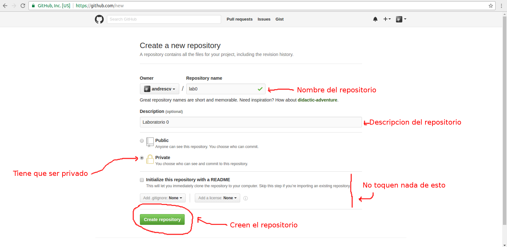
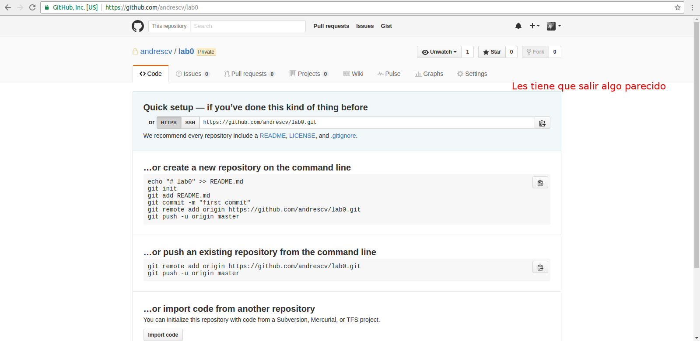
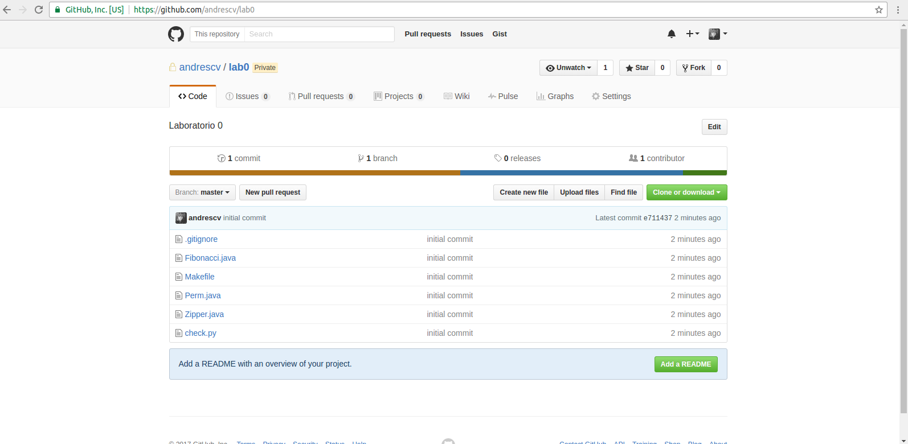

# lab0-starter

title:  "Laboratorio 0"
date:   2017-01-01
category: lab
description: >
    En este laboratorio van a verificar si tienen las "habilidades" necesarias de programación para este curso. Crearan una cuenta de github, aprenderán a utilizar git y realizarán unos ejercicios en Java.

#### Empezando

Para el curso de CC-3 necesitamos que sepan que es un control de versiones, ya que sera necesario para los proyectos. Especificamente vamos a estar usando [Git](https://git-scm.com/) en conjunto con [Github](https://github.com/).

[Aquí](https://classroom.udacity.com/courses/ud775) hay un curso de **Udacity**  donde les enseñan Git y Github, lo pueden terminar en un día, no es necesario que hagan los **_"reflections"_** que indican y como complemento [aquí](http://rogerdudler.github.io/git-guide/index.es.html) hay una guía de Git sencilla.

##### Instalando Git

Como vamos a estar utilizando una distribución de Linux (**_Ubuntu_**) unicamente para este curso, si ustedes quieren instalar git en sus computadoras, pueden utilizar el siguiente comando:

```shell
~ $ sudo apt-get install git
```

##### Creando una cuenta en github y activando el student pack

Pueden crear una cuenta en **Github** con su correo [aqui](https://github.com/). Les recomendamos que pongan un username decente/profesional que contenga su nombre, si es posible, no algo como `holypotato1994`.

[](img/lab0_githubfig1.png)

Cuando ya tengan creada su cuenta ahora tienen que ir [aquí](https://education.github.com/pack) para activar su **Github student pack** que les permitirá tener repositorios privados ilimitados (solo queremos que ustedes y el staff de cc3 lo puedan ver) durante su vida estudiantil.

[](img/github_student.png)

con todo esto listo podemos empezar realmente el lab.

***

#### Ejercicio 1: Mi primer repositorio

En este laboratorio ustedes van a crear su primer repositorio (si es que nunca habian creado uno) y van a utilizarlo con sus archivos del lab, asi que empecemos:


Primero que nada necesitan tener todos los archivos del laboratorio y en este caso van a ser 5, que pueden descargar <a href="https://www.dropbox.com/s/brzs7b27w09puk0/lab0.zip?dl=1" target="_blank">aquí</a>

Esto les va a bajar un archivo llamado **lab0.zip** que pueden descomprimir de la siguiente manera:

```shell
~ $ unzip lab0.zip
```

y dentro de la carpeta **lab0** van a encontrar:

1. **Fibonacci.java:** aqui van a implementar fibonacci
2. **Zipper.java:** aqui van a implementar un zipper
3. **Perm.java:** aqui van a implementar una funcion para permutar
4. **.gitignore:** no se modifica es parte de git
5. **check.py:** autograder

Si los abren con su editor de texto favorito, cada uno de los .java se tiene que ver asi:

##### Fibonacci.java

```java
public class Fibonacci {

    // Retorna el enesimo numero de Fibonacci. Asuman que n >= 0.s
    public static int fibonacci(int n) {
        // Su codigo aqui
        return 0;
    }

    // NO MODIFICAR A PARTIR DE AQUI

    public static void main(String[] args) {
        if(args.length > 0) {
            int n = Integer.parseInt(args[0]);
            System.out.println("Fibonacci de " + n + ": " + fibonacci(n));
        } else {
            System.err.println("No se paso ningun argumento");
        }
    }

}
```

##### Zipper.java

```java
public class Zipper {

    // Deben asumir que first y second no son null
    public static int[] zipper(int[] first, int[] second) {
        // Su codigo aqui
        return new int[1];
    }

    // NO MODIFICAR A PARTIR DE AQUI

    public static int[] str2Array(String s) {
        s = s.replace("[", "");
        s = s.replace("]", "");
        String[] strarr = s.split(",");
        int[] intarr = new int[strarr.length];
        for(int i=0; i < strarr.length; i++) {
            intarr[i] = Integer.parseInt(strarr[i]);
        }
        return intarr;
    }

    public static void main(String[] args) {
        if(args.length > 0) {
            int[] arr1 = str2Array(args[0]);
            int[] arr2 = str2Array(args[1]);
            int[] result = zipper(arr1, arr2);
            System.out.print("[");
            for(int i=0; i < result.length - 1; i++) {
                System.out.print(result[i]+", ");
            }
            System.out.println(result[result.length-1] + "]");
        } else {
            System.err.println("")
        }
    }

}
```

##### Perm.java

```java
public class Perm {

    // Asuma que todos los parametros son validos
    public static String permutation(String message, int spaces) {
        // Su codigo aqui
        return "";
    }

    // NO MODIFICAR A PARTIR DE AQUI

    public static void main(String[] args) {
        if(args.length > 0) {
            String entry = args[0];
            int spaces = Integer.parseInt(args[1]);
            System.out.println(permutation(entry, spaces));
        } else {
            System.err.println("No se paso ningun argumento");
        }
    }

}
```

Ya que tenemos todos los archivos en `lab0`, es momento de crear el repositorio local para eso:

(asumiendo que tienen la carpeta en el escritorio)

```shell
~ $ cd ~/Desktop/lab0
~/Desktop/lab0 $ git init
```

esto hace que se cree un nuevo repositorio (local) y se va a crear una carpeta llamada  **_.git_** en su directorio de trabajo, si es que todo salio bien (para verla tienen que utilizar CTRL + H y para dejar de verla lo mismo).

##### Github

Ahora vamos a **Github** a crear un repositorio "remoto" para eso tenemos que hacer lo siguiente:

En la pagina principal, dar click en new repository:

[](img/lab0_gitfig1.png)

Luego tenemos que llenar los siguientes campos de la siguiente manera:

[](img/lab0_gitfig2.png)

Luego de crearlo nos tiene que aparecer algo asi:

[](img/lab0_gitfig3.png)

ya que tenemos esto podemos actualizar el repositorio remoto con el local de la siguiente manera:

Primero agregamos un repositorio remoto a nuestro repositorio local, para eso tienen que copiar la url del https que les aparece en **Github** cuando crearon el repositorio:


```shell
~/Desktop/lab0 $ git remote add origin [su URL de su repo remoto aqui]
~/Desktop/lab0 $ git remote
origin
```

Despues tenemos que agregar al **staging area** los archivos, en otras palabras solo agregamos los archivos que formaran un commit. En este caso como son todos, simplemente podemos hacer:

```shell
~/Desktop/lab0 $ git add .
```

Pueden probar esto para ver si lo tienen igual, esto muestra el status del repositorio actual:

```shell
~/Desktop/lab0 $ git status
On branch master

Initial commit

Changes to be committed:
  (use "git rm --cached <file>..." to unstage)

	new file:   .gitignore
	new file:   Fibonacci.java
	new file:   Makefile
	new file:   Perm.java
	new file:   Zipper.java
	new file:   check.py
```

Creamos nuestro primer commit:

```shell
~/Desktop/lab0 $ git commit -m "initial commit"
```

Actualizamos el repositorio remoto:

```shell
~/Desktop/lab0 $ git push -u origin master
```

Y en **Github** se tiene que ver asi:

[](img/lab0_initialcommit.png)

Con esto ya listo podemos empezar a programar (?)

para ver si tienen todo bien pueden probar lo siguiente:

```shell
~/Desktop/lab0 $ make check-ej1
python check.py 1
Calificando Ejercicio: 1
....................
Nota: 25/25
```

Si siguieron los pasos, por lo menos lo de `git init` deberian sacar 25/25 de lo contrario su nota sera 0 para este ejercicio (simple).

***

#### Ejercicio 1.1: Fibonacci

En el archivo **Fibonacci.java** editen la función **fibonacci** que, dado un número n, retorne el enésimo número de la serie de Fibonacci. La firma de la función está dada por el código de abajo:

```java
// Retorna el enesimo numero de Fibonacci. Asuman que n >= 0.
public static int fibonacci(int n) {
    // Su codigo aqui
    return 0;
}
```

La serie de Fibonacci está definida por lo siguiente:

```
Fib0 = 0
Fib1 = 1
Fibn = Fibn-1 + Fibn-2        

Donde Fibn es el n-esimo numero de Fibonacci.
```

La lista de los primeros 10 números de Fibonacci son los siguientes:

```
Fib0 = 0
Fib1 = 1
Fib2 = 1
Fib3 = 2
Fib4 = 3
Fib5 = 5
Fib6 = 8
Fib7 = 13
Fib8 = 21
Fib9 = 34
```

si creen que tienen todo bien pueden probar

```shell
~/Desktop/lab0 $ make check-ej2
javac Fibonacci.java Zipper.java Perm.java
python check.py 2
Calificando Ejercicio: 2
....................
Nota: 25/25
```

Si sacaron 25 de 25 pueden subirlo de una vez al repositorio remoto de Github
para terminar este ejercicio de la siguiente manera:

```shell
~/Desktop/lab0 $ git add Fibonacci.java
~/Desktop/lab0 $ git commit -m "ejercicio 2 terminado"
~/Desktop/lab0 $ git push -u origin master
```

***

#### Ejercicio 1.2: Zipper

Escriban una función que dado dos arreglos, retorne un nuevo arreglo que contenga todos los elementos de ambos arreglos ordenados de menor a mayor. Por ejemplo, si los arreglos de entrada son los siguientes:

```java
entrada_1 = {1, 4, 7, 8, 8 , 9}
entrada_2 = {2, 4, 6, 8}
```

La salida debería de ser un arreglo que contenga los elementos en el siguiente orden:

```java
salida = {1, 2, 4, 4, 6, 7, 8, 8, 8, 9}
```

La firma de la función está dada por el siguiente código:

```java
// Deben asumir que first y second no son null
public static int[] zipper(int[] first, int[] second) {
    // Su codigo aqui
    return new int[1];
}
```

si creen que tienen todo bien pueden probar

```shell
~/Desktop/lab0 $ make check-ej3
javac Fibonacci.java Zipper.java Perm.java
python check.py 3
Calificando Ejercicio: 3
....................
Nota: 25/25
```

Si sacaron 25 de 25 pueden subirlo de una vez al repositorio remoto de Github
para terminar este ejercicio de la siguiente manera:

```shell
~/Desktop/lab0 $ git add Zipper.java
~/Desktop/lab0 $ git commit -m "ejercicio 3 terminado"
~/Desktop/lab0 $ git push -u origin master
```

***

#### Ejercicio 1.3: Permutación

Escriban una función que, dado un string de letras minúsculas, y un entero positivo, devuelva un nuevo string con el mensaje permutado la cantidad indicada de espacios.

Por ejemplo, si el mensaje recibido es “abcdefg”y el número es 3, ‘a’ ahora se correría y se volvería ‘d’ , ‘b’ se volvería ‘e’ , ‘c’ se volvería ‘f’ , y así sucesivamente, así que el nuevo mensaje sería “defghij”. Utilicen el alfabeto inglés (NO INCLUYAN LA LETRA ‘ñ’).

Algo importante es que si yo tengo como entrada "abc" y quiero permutarlo 26 veces el resultado deberia de ser "abc" ya que el alfabeto en este caso es de 26 letras daria una vuelta completa. Si tengo la misma entrada y quiero permutarlo 27 veces el resultado deberia de ser "bcd" ya que dio una vuelta completa y se corrio 1 vez mas.

La firma de la función es la siguiente:

```java
// Asuman que todos los parametros son validos
public static String permutation(String message, int spaces) {
    // Su codigo aqui
    return "";
}
```

si creen que tienen todo bien pueden probar

```shell
~/Desktop/lab0 $ make check-ej4
javac Fibonacci.java Zipper.java Perm.java
python check.py 4
Calificando Ejercicio: 4
....................
Nota: 25/25
```

Si sacaron 25 de 25 pueden subirlo de una vez al repositorio remoto de Github
para terminar este ejercicio de la siguiente manera:

```shell
~/Desktop/lab0 $ git add Perm.java
~/Desktop/lab0 $ git commit -m "ejercicio 4 terminado"
~/Desktop/lab0 $ git push -u origin master
```
